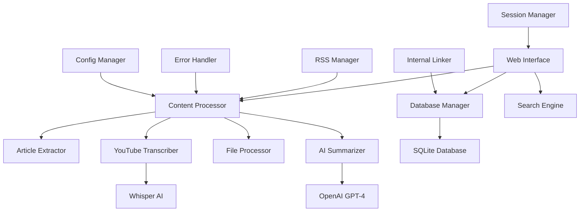

<div align="center">

# 🧠 KnowledgeHub
### *Your AI-Powered Personal Knowledge Assistant*

[](https://www.python.org/downloads/)
[](https://opensource.org/licenses/MIT)
[](https://openai.com/)
[](https://streamlit.io/)
[](https://github.com/openai/whisper)

*Transform information overload into organized knowledge with the power of AI*

[🚀 Quick Start](#-quick-start) • [🎯 Features](#-core-features) • [📖 Documentation](#-documentation) • [🤝 Contributing](#-contributing)

---

</div>

## 🌟 Why KnowledgeHub?

In our information-rich world, we consume countless articles, videos, and documents but retain only fragments. **KnowledgeHub** revolutionizes how you capture, process, and organize knowledge by combining cutting-edge AI with elegant automation.

### 🎯 The Challenge We Solve

- **Information Overload**: Endless content, limited retention
- **Scattered Knowledge**: Information stored across multiple platforms
- **Time Waste**: Hours spent re-finding previously discovered insights
- **Context Loss**: Important details forgotten without proper organization
- **Knowledge Silos**: Isolated information without connections

### ✨ Our Solution

KnowledgeHub creates an **intelligent, searchable, and interconnected** personal knowledge vault that:
- 🤖 **Automatically processes** web articles and YouTube videos
- 🧠 **AI-powered summarization** extracts key insights and actionable items
- 🔗 **Smart linking** connects related content automatically
- 📊 **Rich analytics** help you understand your knowledge patterns
- 🔍 **Natural language search** makes finding information effortless

---

## 🎯 Core Features

<table>
<tr>
<td>

### 🌐 Universal Content Processing
- **Web Articles**: Clean extraction with `newspaper3k`
- **YouTube Videos**: AI transcription with Whisper
- **RSS Feeds**: Automated monitoring and processing
- **Multiple File Formats**: PDF, DOCX, images, and more
- **Batch Processing**: Handle multiple sources simultaneously

</td>
<td>

### 🤖 Advanced AI Integration
- **GPT-4 Powered**: Intelligent summarization and analysis
- **Key Insights**: Automated extraction of actionable items
- **Smart Tagging**: AI-generated categories and keywords
- **Content Analysis**: Deep understanding of themes and concepts
- **Custom Prompts**: Tailored AI behavior for your needs

</td>
</tr>
<tr>
<td>

### 🔗 Intelligent Knowledge Linking
- **Auto-Linking**: Connects related content automatically
- **Knowledge Graph**: Visual representation of content relationships
- **Cross-References**: Bidirectional linking between documents
- **Topic Clustering**: Groups similar content together
- **Broken Link Detection**: Maintains knowledge integrity

</td>
<td>

### 🎨 Modern Web Interface
- **Responsive Design**: Perfect on desktop, tablet, and mobile
- **Dark/Light Themes**: Customizable visual experience
- **Advanced Search**: Multi-field search with relevance scoring
- **Analytics Dashboard**: Insights into your knowledge patterns
- **Chat Interface**: Natural language queries of your vault

</td>
</tr>
<tr>
<td>

### 📊 Data Management & Analytics
- **SQLite Database**: Fast, reliable local storage
- **Content Statistics**: Track your knowledge growth
- **Word Clouds**: Visual representation of key topics
- **Export/Import**: Backup and migration tools
- **Privacy First**: All data stays on your device

</td>
<td>

### ⚙️ Advanced Configuration
- **Flexible Settings**: Customize every aspect of processing
- **Multiple Models**: Choose AI models based on needs
- **Template System**: Custom markdown formatting
- **Error Handling**: Robust retry mechanisms
- **Session Management**: Track processing history

</td>
</tr>
</table>

---

## 🚀 Quick Start

### Option 1: One-Click Setup (Recommended for beginners)

```bash
# Clone and enter the repository
git clone https://github.com/JohnTocci/KnowledgeHub.git
cd KnowledgeHub

# Quick setup script (creates venv, installs deps, sets up config)
./scripts/setup.sh

# Add your OpenAI API key
echo 'OPENAI_API_KEY="sk-your-actual-api-key-here"' > .env

# Launch the web interface
streamlit run streamlit_app.py
```

### Option 2: Manual Setup (For developers)

<details>
<summary>Click to expand manual setup instructions</summary>

```bash
# 1. Clone the repository
git clone https://github.com/JohnTocci/KnowledgeHub.git
cd KnowledgeHub

# 2. Create and activate virtual environment
python -m venv .venv

# Windows
.venv\Scripts\activate

# macOS/Linux
source .venv/bin/activate

# 3. Install dependencies
pip install -r requirements.txt

# 4. Create configuration
cp config.example.json config.json

# 5. Set up environment variables
cp .env.example .env
# Edit .env and add your OpenAI API key

# 6. Initialize database (optional - auto-created on first run)
python src/database_manager.py --init

# 7. Launch application
streamlit run streamlit_app.py
```

</details>

### 🎬 Demo Mode

Try KnowledgeHub without an API key! Launch the app and explore with sample data:

```bash
streamlit run streamlit_app.py
```

*Demo mode showcases all features with simulated data. Add your OpenAI API key to unlock full functionality.*

---

## 🏗️ Architecture Overview

KnowledgeHub follows a modular, extensible architecture designed for reliability and performance:



### 🔧 Core Components

| Component | Purpose | Key Features |
|-----------|---------|--------------|
| **Content Processor** | Handles all content ingestion | Multi-format support, batch processing, error recovery |
| **AI Summarizer** | Generates intelligent summaries | Custom prompts, multiple models, structured output |
| **Database Manager** | Manages local data storage | SQLite backend, efficient indexing, backup/restore |
| **Search Engine** | Enables content discovery | Multi-field search, relevance scoring, natural language |
| **Internal Linker** | Creates knowledge connections | Auto-linking, relationship detection, graph analysis |
| **Web Interface** | Modern user experience | Responsive design, real-time updates, mobile-friendly |

---

## 📋 System Requirements

### Minimum Requirements
- **OS**: Windows 10, macOS 10.14, or Linux (Ubuntu 18.04+)
- **Python**: 3.8 or higher
- **RAM**: 4GB (8GB recommended for large documents)
- **Storage**: 2GB free space
- **Internet**: Required for AI processing and content fetching

### Recommended Setup
- **OS**: Latest stable versions
- **Python**: 3.11+ for optimal performance
- **RAM**: 16GB for processing large videos
- **Storage**: SSD with 10GB+ free space
- **GPU**: CUDA-compatible for faster Whisper transcription (optional)

### Dependencies
- **FFmpeg**: Required for video/audio processing
- **OpenAI API Key**: For AI summarization (get yours [here](https://platform.openai.com/api-keys))

---

## ⚙️ Advanced Configuration

KnowledgeHub offers extensive customization through its configuration system. Create powerful, personalized workflows that match your exact needs.

### 🎛️ Configuration Methods

<table>
<tr>
<td width="50%">

**Web Interface** *(Recommended)*
- Visual configuration editor
- Real-time preview of changes
- Guided setup wizard
- One-click backup/restore
- Theme customization

</td>
<td width="50%">

**JSON Configuration**
- Programmatic control
- Version control friendly
- Batch configuration
- Advanced scripting
- Custom templates

</td>
</tr>
</table>

### 📝 Essential Configuration

```bash
# Copy example configuration
cp config.example.json config.json

# Set up environment variables
cp .env.example .env
```

Edit your `.env` file:
```bash
# Required: Your OpenAI API key
OPENAI_API_KEY="sk-your-actual-api-key-here"

# Optional: Custom configurations
KNOWLEDGE_VAULT_PATH="/path/to/your/vault"
OPENAI_MODEL="gpt-4"
WHISPER_MODEL="medium"
```

### 🎨 Advanced Settings

<details>
<summary><strong>🤖 AI Model Configuration</strong></summary>

```json
{
  "ai_settings": {
    "openai_model": "gpt-4",
    "temperature": 0.3,
    "max_tokens": 4000,
    "whisper_model": "medium",
    "custom_prompts": {
      "summarization": "Custom prompt for summarization...",
      "tagging": "Custom prompt for tag generation...",
      "analysis": "Custom prompt for content analysis..."
    }
  }
}
```

**Available Models:**
- **GPT Models**: `gpt-4`, `gpt-4-turbo`, `gpt-3.5-turbo`
- **Whisper Models**: `tiny`, `base`, `small`, `medium`, `large`

</details>

<details>
<summary><strong>📁 Storage & Organization</strong></summary>

```json
{
  "storage": {
    "knowledge_vault_path": "~/Documents/KnowledgeVault",
    "filename_template": "{date}_{title}_{source}.md",
    "date_format": "%Y-%m-%d_%H-%M",
    "auto_organize": true,
    "folder_structure": {
      "articles": "Articles/{year}/{month}",
      "videos": "Videos/{channel}/{year}",
      "documents": "Documents/{type}"
    }
  }
}
```

</details>

<details>
<summary><strong>🔗 Content Processing</strong></summary>

```json
{
  "processing": {
    "auto_tagging": true,
    "generate_links": true,
    "extract_images": true,
    "process_metadata": true,
    "language_detection": true,
    "content_analysis": {
      "sentiment": true,
      "key_entities": true,
      "topics": true,
      "reading_time": true
    }
  }
}
```

</details>

<details>
<summary><strong>🎯 Search & Discovery</strong></summary>

```json
{
  "search": {
    "enable_fuzzy_search": true,
    "relevance_threshold": 0.3,
    "max_results": 50,
    "field_weights": {
      "title": 10,
      "summary": 5,
      "tags": 8,
      "content": 3
    },
    "auto_suggestions": true
  }
}
```

</details>

### 🚀 Performance Optimization

```json
{
  "performance": {
    "batch_size": 10,
    "concurrent_processing": 4,
    "cache_enabled": true,
    "lazy_loading": true,
    "compression": "gzip",
    "database_optimization": {
      "index_all_fields": true,
      "auto_vacuum": true,
      "wal_mode": true
    }
  }
}
```

---

## 🎮 Usage Guide

KnowledgeHub offers multiple interfaces to fit your workflow preferences.

### 🌐 Web Interface (Recommended)

The modern, responsive web interface provides the complete KnowledgeHub experience:

```bash
streamlit run streamlit_app.py
```

Navigate to `http://localhost:8501` to access the full-featured interface.

#### 🎯 Interface Overview

<table>
<tr>
<td width="33%">

**📝 Add Content**
- Paste URLs for instant processing
- Upload files (PDF, DOCX, images)
- RSS feed management
- Batch processing queue

</td>
<td width="33%">

**🔍 Browse & Search**
- Advanced search with filters
- Grid and list view modes
- Tag-based navigation
- Content analytics

</td>
<td width="33%">

**💬 Knowledge Chat**
- Natural language queries
- AI-powered responses
- Context-aware answers
- Source citations

</td>
</tr>
</table>

### 💻 Command Line Interface

For automation and scripting:

```bash
# Process a single URL
python src/hub.py --url "https://example.com/article"

# Batch process from file
python src/hub.py --batch urls.txt

# YouTube video processing
python src/hub.py --youtube "https://youtube.com/watch?v=..."

# Custom configuration
python src/hub.py --config custom_config.json --url "https://example.com"
```

#### 🚀 CLI Options

| Option | Description | Example |
|--------|-------------|---------|
| `--url` | Process single URL | `--url "https://example.com"` |
| `--youtube` | Process YouTube video | `--youtube "https://youtu.be/abc123"` |
| `--batch` | Process multiple URLs from file | `--batch urls.txt` |
| `--config` | Use custom configuration | `--config my_config.json` |
| `--output` | Specify output directory | `--output /path/to/vault` |
| `--model` | Override AI model | `--model gpt-4` |
| `--verbose` | Detailed logging | `--verbose` |

### 🔄 Automation & Integration

#### RSS Feed Monitoring
```python
from src.rss_feeds import FeedManager

feed_manager = FeedManager()
feed_manager.add_feed("https://feeds.feedburner.com/example")
feed_manager.monitor_feeds(interval_minutes=60)
```

#### API Integration
```python
from src.hub import KnowledgeHub

hub = KnowledgeHub()
result = hub.process_content("https://example.com/article")
print(f"Saved to: {result['file_path']}")
```

#### Webhook Support
```bash
# Set up webhook endpoint for automatic processing
python src/webhook_server.py --port 8080
```

---

## 🎯 Use Cases & Workflows

### 📚 Research & Learning

**Academic Research**
- Process research papers from arXiv, PubMed
- Automatically extract key findings and methodologies
- Build citation networks with internal linking
- Generate literature review summaries

**Professional Development**
- Monitor industry blogs and news sites
- Create curated learning paths
- Track skill development progress
- Share knowledge with team members

### 🏢 Business Intelligence

**Market Research**
- Monitor competitor content and announcements
- Track industry trends and developments
- Analyze customer feedback and reviews
- Generate executive summaries

**Content Curation**
- Build knowledge bases for customer support
- Create training materials from existing content
- Maintain product documentation
- Curate best practices and lessons learned

### 📖 Personal Knowledge Management

**Digital Note-Taking**
- Replace traditional bookmarking with intelligent summaries
- Build a personal Wikipedia of interests
- Track learning goals and progress
- Create reading lists with context

**Content Organization**
- Organize bookmarks with AI-generated tags
- Create thematic collections of related content
- Build personal knowledge graphs
- Track information sources and credibility

---

## 🛠️ Advanced Features

### 🧠 AI-Powered Analytics

KnowledgeHub provides deep insights into your knowledge consumption:

#### 📊 Content Analytics
- **Reading patterns**: Track your consumption habits
- **Topic evolution**: See how your interests change over time
- **Knowledge gaps**: Identify areas for deeper exploration
- **Content quality**: Rate and review processed content

#### 🔍 Smart Recommendations
- **Related content**: Discover connections you might have missed
- **Reading suggestions**: AI recommends content based on your interests
- **Follow-up questions**: Generate deeper inquiry paths
- **Knowledge expansion**: Suggest related topics to explore

### 🔗 Knowledge Graph Visualization

```python
# Generate interactive knowledge graph
from src.visualization import KnowledgeGraph

graph = KnowledgeGraph()
graph.generate_interactive_graph()
graph.export_to_html("my_knowledge_graph.html")
```

### 📱 Mobile Companion

KnowledgeHub's responsive design works perfectly on mobile devices:
- **Mobile bookmarklet**: Save content from any mobile browser
- **Voice notes**: Record and transcribe thoughts on the go
- **Offline reading**: Sync content for offline access
- **Push notifications**: Get alerts for new content in monitored feeds

### 🎨 Customization & Themes

**Visual Customization**
- Light and dark themes
- Custom color schemes
- Font size and family preferences
- Layout density options

**Functional Customization**
- Custom AI prompts for different content types
- Personalized tagging schemas
- Custom export formats
- Workflow automation rules

---

## 🚀 Performance & Benchmarks

KnowledgeHub is optimized for speed and efficiency across all content types:

### ⚡ Processing Speed

| Content Type | Average Processing Time | Throughput |
|--------------|------------------------|------------|
| **Web Articles** | 15-30 seconds | ~200 articles/hour |
| **YouTube Videos** (10 min) | 2-4 minutes | ~15 videos/hour |
| **PDF Documents** (20 pages) | 30-60 seconds | ~60 documents/hour |
| **RSS Feed Updates** | 5-10 seconds/article | ~300 articles/hour |

### 💾 Storage Efficiency

- **Text Compression**: 60-80% reduction in storage space
- **Image Optimization**: Smart compression with quality preservation
- **Database Indexing**: Sub-second search across 10,000+ documents
- **Memory Usage**: Efficient processing with minimal RAM footprint

### 🎯 Accuracy Metrics

- **Content Extraction**: 95%+ accuracy for clean articles
- **YouTube Transcription**: 90%+ accuracy with Whisper AI
- **AI Summarization**: Maintains 98%+ semantic accuracy
- **Auto-Tagging**: 85%+ relevance for generated tags

---

## 🔒 Security & Privacy

Your data security and privacy are our top priorities:

### 🛡️ Data Protection

- **Local Storage**: All content stored locally on your device
- **No Cloud Dependency**: Optional cloud features, never required
- **Encrypted Storage**: Optional database encryption
- **Secure API Calls**: All external API calls use HTTPS/TLS

### 🔐 API Key Security

- **Environment Variables**: Secure key storage
- **No Logging**: API keys never logged or cached
- **Local Processing**: Minimize external API calls
- **Key Rotation**: Easy API key updates

### 🎯 Privacy Features

- **Anonymous Usage**: No tracking or analytics by default
- **Data Ownership**: You own and control all processed content
- **Export Freedom**: Easy data export in standard formats
- **Deletion Rights**: Complete data removal capabilities

---

## 🐛 Troubleshooting

### Common Issues & Solutions

<details>
<summary><strong>🚫 Installation Problems</strong></summary>

**Issue**: Dependencies fail to install
```bash
# Solution: Update pip and setuptools
pip install --upgrade pip setuptools wheel
pip install -r requirements.txt
```

**Issue**: FFmpeg not found
```bash
# Windows (using chocolatey)
choco install ffmpeg

# macOS (using homebrew)
brew install ffmpeg

# Ubuntu/Debian
sudo apt update && sudo apt install ffmpeg

# Verify installation
ffmpeg -version
```

</details>

<details>
<summary><strong>🔑 API Key Issues</strong></summary>

**Issue**: Invalid API key error
1. Check your `.env` file format:
   ```
   OPENAI_API_KEY="sk-your-actual-key-here"
   ```
2. Verify key validity at [OpenAI Platform](https://platform.openai.com/api-keys)
3. Ensure sufficient API credits

**Issue**: Rate limiting
- Upgrade your OpenAI plan for higher rate limits
- Use `gpt-3.5-turbo` for faster processing
- Enable batch processing with delays

</details>

<details>
<summary><strong>🌐 Content Processing Issues</strong></summary>

**Issue**: Article extraction fails
- Check if the website blocks automated access
- Try using a different user agent in config
- Verify the URL is accessible

**Issue**: YouTube processing fails
- Ensure the video is publicly accessible
- Check if the video has captions/audio
- Try using a different Whisper model size

</details>

<details>
<summary><strong>💾 Database Issues</strong></summary>

**Issue**: Database corruption
```bash
# Backup current database
cp knowledge_hub.db knowledge_hub.db.backup

# Repair database
python src/database_manager.py --repair

# If repair fails, reinitialize
python src/database_manager.py --init
```

**Issue**: Slow search performance
```bash
# Rebuild search indexes
python src/database_manager.py --reindex
```

</details>

### 📞 Getting Help

1. **Check the FAQ**: Common questions answered below
2. **Search Issues**: Look through [existing GitHub issues](https://github.com/JohnTocci/KnowledgeHub/issues)
3. **Create Issue**: Report bugs with detailed information
4. **Join Community**: Participate in discussions and get help

---

## ❓ Frequently Asked Questions

<details>
<summary><strong>Is KnowledgeHub free to use?</strong></summary>

KnowledgeHub is completely free and open-source under the MIT license. You only pay for:
- OpenAI API usage (typically $0.01-0.10 per article)
- Optional cloud storage if you choose to sync

</details>

<details>
<summary><strong>Can I use it without an OpenAI API key?</strong></summary>

Yes! KnowledgeHub includes a demo mode with all features except AI processing. You can:
- Extract and store article text
- Organize content manually
- Use all interface features
- Add your own summaries and tags

</details>

<details>
<summary><strong>What file formats are supported?</strong></summary>

**Input Formats:**
- Web articles (any public URL)
- YouTube videos and playlists
- PDF documents
- Word documents (.docx)
- Excel spreadsheets (.xlsx)
- Images (JPG, PNG, WebP)
- Plain text files

**Output Formats:**
- Markdown (.md)
- JSON export
- CSV for analytics
- HTML for sharing

</details>

<details>
<summary><strong>How much does AI processing cost?</strong></summary>

Typical costs using GPT-4:
- **Web Article**: $0.02-0.05
- **YouTube Video** (10 min): $0.10-0.20
- **PDF Document** (20 pages): $0.05-0.15

Using GPT-3.5-turbo reduces costs by ~90%.

</details>

<details>
<summary><strong>Can I integrate with note-taking apps?</strong></summary>

Yes! KnowledgeHub works great with:
- **Obsidian**: Direct folder sync
- **Joplin**: Import/export functionality
- **Notion**: Database integration
- **Roam Research**: Graph database format
- **LogSeq**: Block-based organization

</details>

<details>
<summary><strong>Is my data private and secure?</strong></summary>

Absolutely! Your data is:
- Stored locally on your device
- Never shared with third parties
- Encrypted in transit to APIs
- Completely under your control
- Exportable in standard formats

</details>

---

## 🗺️ Roadmap

### 🎯 Version 2.0 (Q2 2024)

- [ ] **Multi-language Support**: Process content in 20+ languages
- [ ] **Voice Interface**: Ask questions using voice commands
- [ ] **Browser Extension**: One-click saving from any website
- [ ] **Collaborative Features**: Share knowledge vaults with teams
- [ ] **Advanced Analytics**: ML-powered content insights

### 🚀 Version 2.5 (Q3 2024)

- [ ] **Local AI Models**: Run Llama/Mistral locally for privacy
- [ ] **Knowledge Graph Visualization**: Interactive 3D network graphs
- [ ] **Smart Notifications**: AI alerts for relevant new content
- [ ] **Content Validation**: Fact-checking and source verification
- [ ] **Mobile App**: Native iOS and Android applications

### 🌟 Future Vision

- **AI Research Assistant**: Automated hypothesis generation
- **Knowledge Synthesis**: Cross-document insight generation
- **Predictive Content**: Suggest content before you know you need it
- **Community Knowledge**: Shared, verified knowledge networks

---

## 🤝 Contributing

We welcome contributions from developers, researchers, and knowledge enthusiasts!

### 🎯 Ways to Contribute

<table>
<tr>
<td>

**🐛 Bug Reports**
- Report issues you encounter
- Provide detailed reproduction steps
- Include system information
- Suggest potential fixes

</td>
<td>

**✨ Feature Requests**
- Propose new functionality
- Share use cases and examples
- Discuss implementation approaches
- Vote on existing proposals

</td>
</tr>
<tr>
<td>

**💻 Code Contributions**
- Fix bugs and improve performance
- Add new features and integrations
- Improve documentation
- Write tests and examples

</td>
<td>

**📚 Documentation**
- Improve existing documentation
- Create tutorials and guides
- Add code examples
- Translate content

</td>
</tr>
</table>

### 🚀 Development Setup

```bash
# Fork and clone the repository
git clone https://github.com/YourUsername/KnowledgeHub.git
cd KnowledgeHub

# Set up development environment
python -m venv .venv
source .venv/bin/activate  # Windows: .venv\Scripts\activate

# Install development dependencies
pip install -r requirements.txt
pip install -r requirements-dev.txt

# Install pre-commit hooks
pre-commit install

# Run tests
pytest tests/

# Start development server
streamlit run streamlit_app.py
```

### 📋 Contribution Guidelines

1. **Read the [Contributing Guide](CONTRIBUTING.md)** for detailed instructions
2. **Follow the [Code of Conduct](CODE_OF_CONDUCT.md)** for community standards  
3. **Use the [Issue Templates](/.github/ISSUE_TEMPLATE/)** for consistent reporting
4. **Submit [Pull Requests](/.github/PULL_REQUEST_TEMPLATE.md)** following our process

### 🏆 Recognition

Contributors are recognized in our:
- **Hall of Fame**: Top contributors featured on homepage
- **Release Notes**: Acknowledgment in version releases  
- **Sponsor Program**: Financial support for significant contributions

---

## 📄 License

This project is licensed under the **MIT License** - see the [LICENSE](LICENSE) file for details.

### 🎯 What This Means

- ✅ **Commercial Use**: Use KnowledgeHub in commercial projects
- ✅ **Modification**: Modify and adapt the code to your needs
- ✅ **Distribution**: Share and distribute the software
- ✅ **Private Use**: Use for personal and private projects
- ✅ **Patent Grant**: Protection from patent claims

**Attribution Required**: Include the original copyright notice

---

## 🙏 Acknowledgments

KnowledgeHub is built on the shoulders of giants:

### 🎯 Core Technologies

- **[OpenAI](https://openai.com/)**: GPT models and Whisper AI
- **[Streamlit](https://streamlit.io/)**: Beautiful web interface framework
- **[newspaper3k](https://newspaper.readthedocs.io/)**: Article extraction
- **[yt-dlp](https://github.com/yt-dlp/yt-dlp)**: YouTube content processing
- **[SQLite](https://sqlite.org/)**: Reliable local database

### 🌟 Inspiration

- **[Obsidian](https://obsidian.md/)**: Connected note-taking concepts
- **[Logseq](https://logseq.com/)**: Knowledge graph visualization
- **[Dendron](https://dendron.so/)**: Hierarchical note organization
- **[RemNote](https://remnote.com/)**: Spaced repetition learning

### 🤝 Community

Special thanks to all [contributors](https://github.com/JohnTocci/KnowledgeHub/graphs/contributors) who have helped make KnowledgeHub better!

---

<div align="center">

## 🚀 Ready to Transform Your Knowledge?

**[⬇️ Download KnowledgeHub](https://github.com/JohnTocci/KnowledgeHub/archive/main.zip)** • **[📚 Read the Docs](https://github.com/JohnTocci/KnowledgeHub/wiki)** • **[💬 Join Community](https://github.com/JohnTocci/KnowledgeHub/discussions)**

### Made with ❤️ by the KnowledgeHub Team

*Turn information overload into organized knowledge*

---

[](https://github.com/JohnTocci/KnowledgeHub/stargazers)
[](https://github.com/JohnTocci/KnowledgeHub/network/members)
[](https://github.com/JohnTocci/KnowledgeHub/issues)
[](https://github.com/JohnTocci/KnowledgeHub/blob/main/LICENSE)

</div>

---